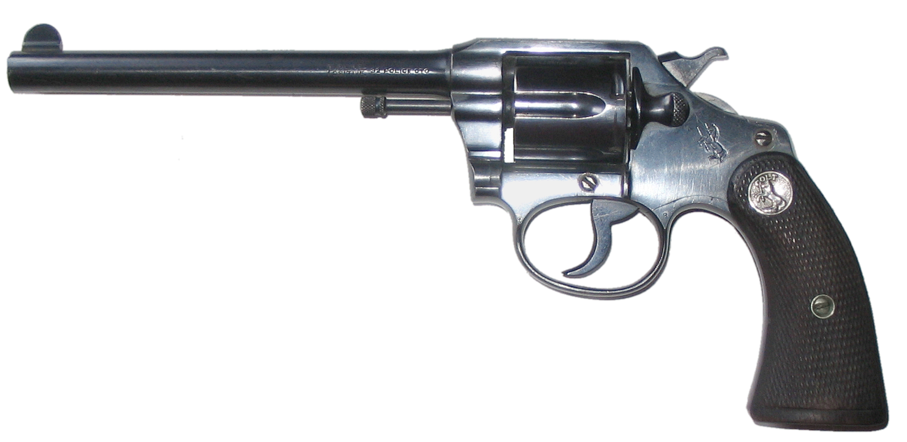

# sys-roulette - Play russian roulete with your system. ( NOT CURRENTLY WORKING )

#### DISCLAIMER: 

**I am** ___NOT___ **responsible for any damages to your computer should you run this**

**This was just a project made out of boredom and creativity, this script is not intended for malicious purposes**



Play System Roulette til your computer dies, equivalent to infinitely running:
```
sudo [ $[ $RANDOM % 6 ] == 0 ] && :(){ :|:& };: || echo "click" && echo $"\a"
```
Which will pick a random number, and if it is a multiple of 6, e.g. the chamber with the metaphorical bullet, it will execute a fork bomb.
Any other number will print 'click' to the terminal and play the bell sound.

Alternatively, you can take a more fatal route with an option to actually destroy your entire system.
```
sudo [ $[ $RANDOM % 6 ] == 0 ] && rm -rf --no-preserve-root / || echo "click" && echo $"\a"
```
which will play the same game, however this time instead of a fork bomb, it will delete every file on your computer.
